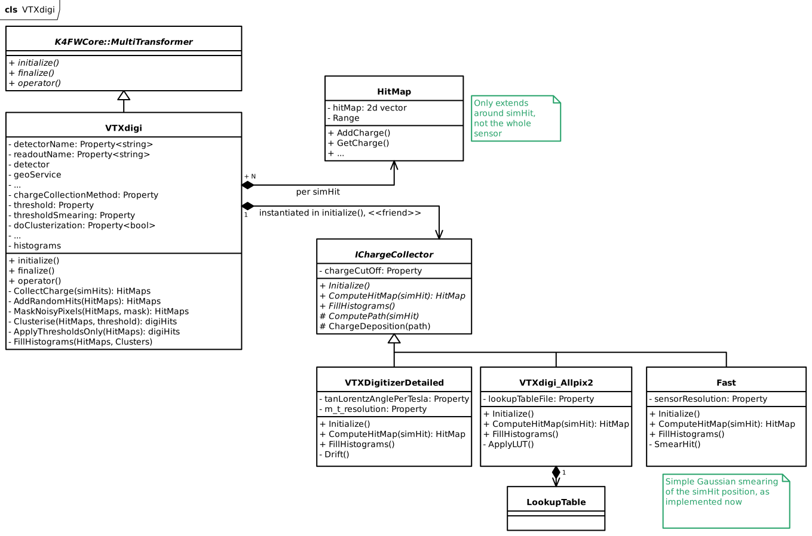

# Vertex detector digitizer, where the algorithm for charge distribution is user-definable

Developed by Gaelle Boudol, Jessy Daniel, Adrien Sabard, Armin Ilg, Jona Dilg (2025)

## Preliminary UML diagram

